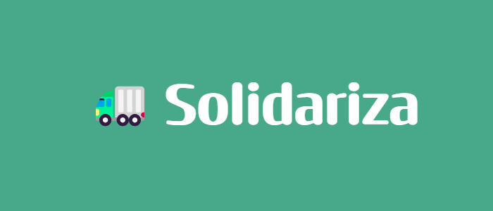
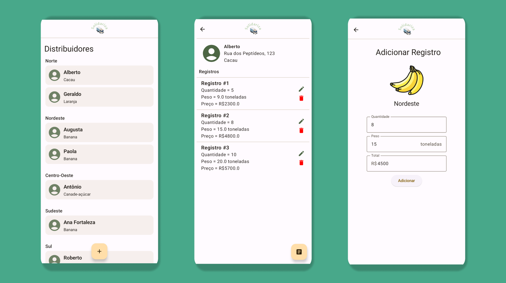

  

# Solidariza

> Obs: A empresa "Solidariza", neste contexto, refere-se à uma empresa fictícia utilizada como caso de uso deste projeto.

O Solidariza é um aplicativo para a organização e gerenciamento de fornecedores para otimizar os processos de distribuição de produtos dos clientes. 

---

## 📋 Funcionalidades

- [X] **Gestão de distribuidores:** Cadastro e gerenciamento de distribuidores.
- [X] **Organização de registros:** Gerenciamento de registros de entradas dos distribuidores.
- [X] **Sincronização com a Web:** Conecta-se à Internet para acessar aos dados pela Web.
- [X] **Navegação offline:** Usuários podem visualizar distribuidores e registros de forma offline.

---

## 📱 Screenshots

---

## 🫴Autores

- [Gustavo Almeida Carvalho](https://github.com/gustxvo)
- [Vinicius Mazon Viturino](https://github.com/ViniMazon)
